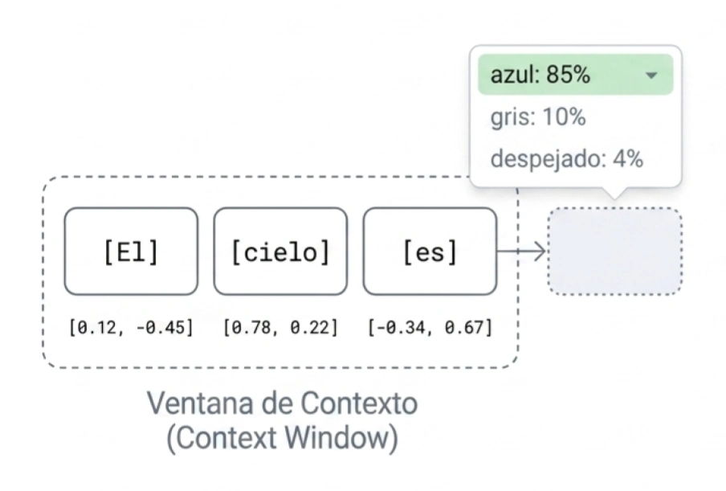

Para que puedan liderar la implementación de tecnologías avanzadas, es indispensable manejar con precisión la terminología técnica y operativa de la IA. A continuación, los conceptos esenciales que constituyen el lenguaje base de esta disciplina son los siguientes organizados en categorías o ámbitos de acción:

## Sistemas inteligents
#### La Jerarquía

*   **Inteligencia Artificial (IA):** Se define como un sistema basado en ingeniería que, a partir de un conjunto de objetivos definidos por humanos, genera salidas (outputs) tales como predicciones, recomendaciones o decisiones que influyen en entornos reales o virtuales. Su propósito fundamental es emular capacidades cognitivas humanas para resolver problemas complejos.
*   **Machine Learning (Aprendizaje Automático):** Es una rama de la IA centrada en el desarrollo de algoritmos que permiten a las computadoras identificar patrones y aprender de los datos de manera autónoma, sin necesidad de instrucciones de programación explícitas para cada tarea.
*   **Deep Learning (Aprendizaje Profundo):** Representa una evolución del aprendizaje automático que utiliza redes neuronales artificiales multicapa para procesar información en niveles crecientes de abstracción. Es la tecnología detrás de los avances más disruptivos en visión por computadora y lenguaje natural.
*   **Redes Neuronales:** Son modelos computacionales inspirados en la estructura biológica del cerebro humano. Consisten en nodos interconectados (neuronas artificiales) que transmiten señales entre sí para procesar datos y aprender relaciones complejas.

#### El Ciclo de la Información y la Lógica Algorítmica

*   **Datos:** Son hechos primarios o elementos crudos que carecen de contexto por sí solos. En el marco de la ISO 42001, la gestión de los recursos de datos es crítica, incluyendo su procedencia y calidad.
*   **Información:** Surge cuando los datos son procesados, organizados y estructurados para que tengan un significado y propósito dentro de un contexto institucional.
*   **Conocimiento:** Es la síntesis de la información aplicada a la toma de decisiones, la resolución de problemas y la planificación estratégica en la gestión pública.
*   **Algoritmos:** Constituyen el conjunto de instrucciones lógicas y reglas matemáticas que guían el procesamiento de los datos para alcanzar un resultado específico.
*   **Modelos:** Es la estructura o "programa" resultante tras someter un algoritmo a un proceso de aprendizaje con datos. El modelo es el artefacto que efectivamente realiza las predicciones o genera contenido.

#### Arquitecturas y Capacidades Modernas

*   **Modelos Fundacionales:** Son modelos de IA entrenados en volúmenes masivos de datos a una escala tan amplia que pueden adaptarse a una vasta gama de tareas posteriores mediante ajustes mínimos.
*   **LLM (Large Language Models):** Son modelos de lenguaje a gran escala, como GPT-4 o Claude, entrenados para comprender, resumir, traducir y generar texto con una coherencia similar a la humana.
*   **IA Generativa:** Es una categoría de IA diseñada para crear contenido nuevo y original, ya sea texto, imágenes, audio o código, basándose en los patrones aprendidos durante su entrenamiento.
*   **IA Agéntica:** Representa sistemas que no solo responden a consultas, sino que actúan como agentes con autonomía para planificar tareas, utilizar herramientas y ejecutar acciones orientadas a objetivos complejos.

#### Mecánica Técnica del Procesamiento

*   **Entrenamiento:** Es el proceso sistemático mediante el cual se exponen algoritmos a grandes conjuntos de datos para que el modelo ajuste sus parámetros internos y aprenda a realizar tareas específicas.
*   **Inferencia:** Es la fase operativa en la que un modelo ya entrenado procesa datos nuevos para generar una respuesta o resultado.

*   **Tokens:** Son las unidades básicas de procesamiento en los modelos de lenguaje. Un token puede ser una palabra, una sílaba o incluso un solo carácter, permitiendo a la IA fragmentar el lenguaje para su análisis.

*  **Ventana de contexto:** Es la memoria de trabajo a corto plazo del modelo. Es finita. Sobrecargarla con información irrelevante degrada severamente la calidad de la respuesta.

*   **Embeddings:** Son representaciones numéricas (vectores) de los tokens que capturan su significado semántico. Permiten que la IA "entienda" que palabras como "alcalde" y "municipio" están relacionadas contextualmente aunque se escriban diferente.

*   **Vectorización:** Es el proceso matemático de convertir datos (texto, imágenes) en listas de números (vectores) para que puedan ser procesados por los algoritmos de IA.


## Token

Dentro del **Módulo 1: Fundamentos de Inteligencia Artificial**, a continuación se presenta la definición técnica y académica de **token**, un concepto esencial para comprender cómo operan los Modelos de Lenguaje de Gran Tamaño (LLM) como GPT-4 o Gemini.

### Definición
En el ámbito del Procesamiento del Lenguaje Natural (NLP) y los modelos de inteligencia artificial generativa, un **token** es la unidad semántica o lingüística fundamental de procesamiento. Se puede definir como un fragmento de texto (que puede ser una palabra completa, una parte de una palabra, un solo carácter o un signo de puntuación) que el modelo utiliza como bloque básico para entender la entrada y predecir la salida.

Los modelos de IA no "leen" palabras como los humanos; en su lugar, el texto se somete a un proceso llamado **tokenización**, donde se descompone en estos fragmentos discretos. Posteriormente, cada token se convierte en una representación numérica (vector) para que la máquina pueda realizar cálculos matemáticos sobre ellos.

### ¿Cómo se descompone el texto?
Un token no siempre equivale a una palabra. Dependiendo del algoritmo de tokenización (como *Byte-Pair Encoding* o BPE), la división puede variar:

*   **Palabras simples:** Una palabra común puede ser un solo token.
    *   Ejemplo: `perro` $\rightarrow$ `[perro]`.

*   **Palabras complejas o derivadas:** Se dividen en componentes con significado propio (morfemas).

    *   Ejemplo: `cocinando` $\rightarrow$ `[cocin]` + `[ando]`.
*   **Contracciones y puntuación:** Los signos y las abreviaturas se separan.
    *   Ejemplo en inglés: `I'd` $\rightarrow$ `[I]` + `['d]`.
    *   Ejemplo de frase: `¡Hola mundo!` $\rightarrow$ `[¡]`, `[Hola]`, `[mundo]`, `[!]`.

*   **Palabras desconocidas:** Si el modelo encuentra una palabra que no está en su vocabulario, la divide en caracteres o sub-unidades que sí conoce para intentar entender su estructura.

### Reglas de equivalencia y métricas
Para efectos de planificación y gestión en la administración pública, es vital conocer la equivalencia entre tokens y palabras, ya que la mayoría de los servicios de IA cobran por el volumen de tokens procesados:

*   **Regla general:** En promedio, **100 tokens equivalen a unas 75 palabras** en inglés.

*   **Longitud de caracteres:** Un token suele tener una longitud media de **4 caracteres**.

*   **Vocabulario:** Modelos avanzados como GPT-4 poseen un vocabulario de aproximadamente **100,256 tokens** únicos con los que pueden construir infinitas combinaciones de texto.

### Importancia técnica
El uso de tokens en lugar de palabras completas responde a tres razones fundamentales de ingeniería:
1.  **Eficiencia:** Permite que el modelo maneje un vocabulario más pequeño y manejable sin perder la capacidad de formar millones de palabras distintas.

2.  **Comprensión estructural:** Ayuda al modelo a identificar raíces y sufijos, mejorando su comprensión de la gramática.

3.  **Límites de memoria:** Los modelos tienen una "ventana de contexto" (memoria de trabajo) limitada por un número máximo de tokens (por ejemplo, 8,192 o 128,000 tokens), lo que determina cuánta información pueden "recordar" en una sola sesión.

<center>
<figure>

<figcaption>Los modelos no "entienden" el texto que reciben o el que entregan; calculan representaciones vectoriales para predecir el siguiente token más probable (probabilísticamente).</figcaption>
</figure>
</center>

### Tokenizar una palabra

Dentro del **Módulo 1: Fundamentos de Inteligencia Artificial**, y continuando con la profundización de los conceptos técnicos de procesamiento, se presenta a continuación un análisis detallado sobre cómo los Modelos de Lenguaje de Gran Tamaño (LLM) fragmentan palabras complejas mediante la **tokenización**.

#### 1. El proceso de descomposición en subunidades
A diferencia de un análisis basado en palabras completas, los modelos modernos utilizan algoritmos como **Byte-Pair Encoding (BPE)** para dividir términos complejos en subunidades o morfemas que conservan un significado semántico. Esto permite que el sistema entienda palabras que no ha visto antes basándose en sus componentes.

#### 2. Ejemplos de tokenización de palabras complejas

Para ilustrar este mecanismo, consideremos los siguientes casos basados en las fuentes técnicas:

*   **Palabras con sufijos gramaticales:** La palabra **"cooking"** (cocinando) no suele procesarse como un bloque único. El tokenizador la divide en:
    *   `[cook]` (la raíz que aporta el significado de la acción).
    *   `[ing]` (el sufijo que denota el tiempo continuo o gerundio).
    *   **Lógica:** Al separar el sufijo, el modelo puede generalizar el uso de "-ing" en miles de verbos distintos sin necesidad de memorizar cada variante como una palabra nueva.

*   **Neologismos o términos técnicos desconocidos:** Si el modelo encuentra una palabra inventada o muy específica como **"chatgpting"**, la descompone para intentar comprender su estructura:
    *   `[chatgpt]` (identificado como una entidad o raíz conocida).
    *   `[ing]` (identificado como una unidad funcional).

*   **Contracciones y signos:** En términos compuestos por apóstrofes o signos, el modelo separa las unidades de función. Por ejemplo, **"can't"** se divide habitualmente en:
    *   `[can]`
    *   `['t]`.

#### 3. Justificación técnica de este método
Esta fragmentación en sub-palabras responde a tres objetivos fundamentales de la ingeniería de la IA:
1.  **Eficiencia del vocabulario:** Permite representar millones de combinaciones lingüísticas usando un conjunto limitado de tokens (por ejemplo, los 100,256 tokens de GPT-4).
2.  **Comprensión semántica:** Al capturar morfemas (como "un-", "pre-", "-tion"), el modelo "entiende" que una palabra como "unbelievable" tiene una carga negativa o de negación por el prefijo "un".
3.  **Manejo de errores:** Si un usuario comete un error tipográfico o utiliza una jerga local, el modelo tiene mayores probabilidades de deducir el sentido correcto analizando los fragmentos que sí reconoce.

En términos métricos, este proceso implica que una palabra compleja rara vez equivale a un solo token; generalmente, mientras más larga o técnica sea la palabra, mayor será el número de tokens necesarios para representarla numéricamente.


### Costo de un prompts en token

El cálculo del costo de un prompt en tokens es un proceso fundamental para la gestión de recursos en proyectos de inteligencia artificial, ya que los tokens actúan como la "moneda" de intercambio con los proveedores de modelos de lenguaje (LLM).

Se detalla el procedimiento técnico para realizar este cálculo:

#### 1. La Fórmula del Costo Total
La mayoría de los proveedores de IA (como OpenAI, Google o Anthropic) facturan basándose en el volumen de procesamiento. El costo total de una interacción se calcula sumando dos componentes principales:

```math
Costo Total = (Tokens de entrada x Precio_input) + (Tokens de salida  Precio_output)
```

*   **Tokens de entrada (Input):** Incluyen las instrucciones del prompt, el contexto proporcionado y cualquier dato enviado al modelo.

*   **Tokens de salida (Output):** Se refieren al texto generado por el modelo en su respuesta. Es importante notar que los tokens de salida suelen tener un precio significativamente mayor que los de entrada (en algunos modelos, de 3 a 4 veces más caros).

#### 2. Equivalencia entre Tokens y Texto
Para estimar cuántos tokens consumirá un texto antes de enviarlo, se utilizan reglas de proporción promedio para el idioma inglés:
*   **100 tokens** equivalen aproximadamente a **75 palabras**.
*   **1 token** equivale aproximadamente a **4 caracteres**.
*   **1 millón de tokens** representan cerca de **750,000 palabras** o unas 11 horas de audio transcrito.

En otros idiomas o en textos con terminología técnica compleja, la fragmentación puede ser mayor, lo que aumenta el número de tokens por palabra.

#### 3. Variación de Precios según el Modelo
El costo por millón de tokens varía drásticamente según la complejidad del modelo seleccionado. Según datos de 2025, se observan las siguientes diferencias:

| Modelo | Costo Input (por 1M tokens) | Costo Output (por 1M tokens) |
| :--- | :--- | :--- |
| **GPT-4o** | \$2.50 USD | \$10.00 USD |
| **GPT-3.5-turbo** | \$0.50 USD | \$1.50 USD |
| **Gemini 2.0 Flash**| \$0.10 USD | \$0.40 USD |
| **Mistral NeMo** | \$0.15 USD | \$0.15 USD |

*Fuente: Tabla de costos de modelos comunes (NIST/OCDE).*

#### 4. Herramientas de Estimación y Control
Para gestionar estos costos de manera profesional, existen dos métodos principales:
*   **Uso de Tokenizadores (Pre-ejecución):** Librerías como `tiktoken` (para modelos OpenAI) permiten descomponer el texto en tokens localmente y obtener un conteo exacto antes de realizar el gasto en la API.
*   **Campo "Usage" (Post-ejecución):** Cada respuesta de la API incluye un objeto de metadatos llamado `usage`, que detalla exactamente cuántos `prompt_tokens`, `completion_tokens` y `total_tokens` se utilizaron en esa transacción específica.

Finalmente, algunas arquitecturas avanzadas ofrecen **descuentos por caché de prompts**, donde los tokens de contexto que se repiten con frecuencia (como instrucciones de sistema largas) pueden recibir un descuento de hasta el 75-90% en su costo de procesamiento.

## Ventana de contexto


#### Estrategias de Optimización Institucional

*   **RAG (Generación Aumentada por Recuperación):** Es una técnica que permite a un modelo de IA consultar bases de datos externas o documentos específicos de una institución antes de generar una respuesta. Esto garantiza que la información entregada sea precisa y esté actualizada, reduciendo el riesgo de alucinaciones.
*   **Fine Tuning (Ajuste Fino):** Es el proceso de re-entrenamiento de un modelo pre-existente con un conjunto de datos más pequeño y especializado para optimizar su desempeño en un dominio específico, como la normativa jurídica o administrativa de un país.

### Diferencias entre RAG y Fine Tuning

La distinción técnica entre **RAG** (Generación Aumentada por Recuperación) y **Fine Tuning** (Ajuste Fino) es fundamental para entender cómo se especializa una Inteligencia Artificial para la gestión pública. Las principales diferencias radican en cómo acceden a la información y cómo se actualizan:

### 1. Mecanismo de Operación
*   **RAG (Retrieval-Augmented Generation):** Funciona como un proceso de "consulta a libro abierto". Antes de generar una respuesta, el sistema busca activamente información en **fuentes de datos externas y fidedignas** (bases de datos, leyes o informes) [4, 1.2, ¿Cómo ayuda la técnica RAG a evitar las alucinaciones?]. Proporciona al modelo un contexto enriquecido para que la respuesta esté fundamentada en documentos específicos y no solo en lo que el modelo "recuerda" de su entrenamiento original [¿Cómo ayuda la técnica RAG a evitar las alucinaciones?].
*   **Fine Tuning (Ajuste Fino):** Es un proceso de **re-entrenamiento** del modelo. Se toman los parámetros de un modelo ya existente y se ajustan utilizando un conjunto de datos específico y más pequeño para que el modelo se especialice en un dominio determinado, como la normativa jurídica o administrativa [4, 1.2]. Es comparable a que el modelo "estudie" profundamente un tema hasta que el conocimiento pase a formar parte de su estructura interna.

### 2. Actualización de Conocimientos
*   **RAG:** Permite una **actualización constante e inmediata**. Si la normativa cambia, solo es necesario actualizar el documento en la base de datos externa que el sistema consulta. El modelo no necesita ser re-entrenado para conocer el cambio [¿Cómo ayuda la técnica RAG a evitar las alucinaciones?].
*   **Fine Tuning:** La actualización es **lenta y costosa**. Para que el modelo aprenda nueva información, debe someterse a un nuevo ciclo de entrenamiento, lo que requiere tiempo, capacidad de cómputo y recursos técnicos [¿Cómo ayuda la técnica RAG a evitar las alucinaciones?].

### 3. Precisión y Alucinaciones
*   **RAG:** Es una de las técnicas más eficaces para **reducir alucinaciones** (respuestas falsas con apariencia de verdad). Al obligar al modelo a basarse en información externa recuperada en el momento, se minimiza el riesgo de que invente datos [4, 1.5, ¿Cómo ayuda la técnica RAG a evitar las alucinaciones?].
*   **Fine Tuning:** Aunque especializa al modelo en un lenguaje o formato, no elimina necesariamente las alucinaciones. El modelo sigue confiando en su capacidad predictiva de palabras basadas en su entrenamiento previo, lo que puede llevar a errores si la información está desactualizada o es insuficiente.

### 4. Verificabilidad
*   **RAG:** Ofrece **trazabilidad**. Permite que el sistema cite las fuentes exactas de donde extrajo la información, facilitando que el funcionario público verifique la veracidad de lo entregado [¿Cómo ayuda la técnica RAG a evitar las alucinaciones?].
*   **Fine Tuning:** El conocimiento queda "embebido" en los pesos numéricos del modelo, por lo que no es posible rastrear o citar una fuente documental específica para una respuesta dada.
 
En resumen, mientras que el **Fine Tuning** es útil para que la IA aprenda a hablar o escribir con un estilo técnico particular, el **RAG** es la solución técnica preferida cuando la prioridad es la **precisión factual y la actualización de los datos** en el Estado.

| Característica | RAG | Fine Tuning |
|----------------|-----|-------------|
| Fuente de conocimiento | Externa y actualizable | Interna y fija tras el entrenamiento |
| Costo de actualización | Bajo | Alto |
| Tiempo de implementación | Corto | Largo |
| Riesgo de alucinaciones | Bajo | Medio |
| Especialización | Alta en dominios específicos | Alta en dominios específicos |

