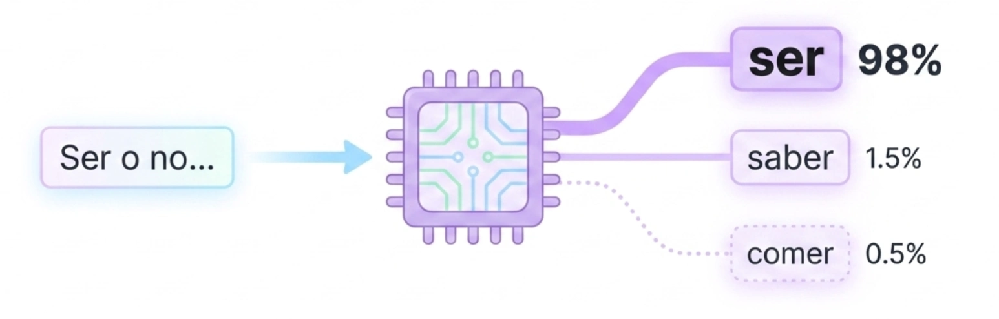

* ChatGPT
* Claude
* Gemini
* Copilot
* Llama
* Mistral
* DeepSeek
* Qwen

Comparación:

* fortalezas
* debilidades
* privacidad
* costo
* aplicaciones

## Modelos generativos

La **Inteligencia Artificial Generativa (IA Generativa)** es una rama avanzada del aprendizaje profundo (*Deep Learning*) que se enfoca en la creación de contenido original a partir de datos existentes. A diferencia de la IA tradicional o "predictiva", cuyo objetivo es clasificar datos o predecir resultados futuros basados en tendencias históricas, los modelos generativos utilizan algoritmos para identificar patrones subyacentes y generar nuevos datos que poseen características similares a los de su entrenamiento.

Técnicamente, estos sistemas no "entienden" el contenido en un sentido humano; son sistemas de predicción estadística altamente sofisticados. Funcionan descomponiendo la información en unidades mínimas llamadas **tokens** y calculando la probabilidad de que un elemento siga a otro en una secuencia coherente.

### Arquitecturas fundamentales

El auge actual de estos modelos se debe principalmente a tres tipos de arquitecturas de redes neuronales:

*   **Transformers:** Introducidos en 2017, permiten procesar datos en paralelo y entender relaciones de largo alcance en un texto mediante un mecanismo de "auto-atención". Es la base de los modelos de lenguaje actuales.

*   **Redes Generativas Adversarias (GANs):** Consisten en dos redes (un "generador" y un "discriminador") que compiten entre sí para crear imágenes o datos tan realistas que sean indistinguibles de los reales.

*   **Modelos de Difusión:** Técnica que genera imágenes a partir de ruido aleatorio, refinándolo progresivamente hasta que coincide con la descripción del usuario.

### Los modelos más utilizados en la actualidad

Dependiendo de la modalidad de salida, los modelos más destacados son:

#### Modelos de Lenguaje (Texto y Razonamiento)

En esencia, un modelo de lenguaje Grande **LLMs** (*Large Language Models*) es una máquina de completado estadístico masivo. A partir de la instrucción de usuario (**prompt**), el modelo realiza cálculos sobre sus **embeddings** para elegir probabilísticamente el siguiente token más lógico, construyendosu respuesta de manera incremental.

<figure>

<figcaption>Se establece la probabilidad más alta de elegir la siguiente palabra.</figcaption>
</figure>

Estos modelos, son los pilares de la gestión documental y la atención ciudadana en los ámbitos públicos donde haya sido adoptada.
*   **GPT (OpenAI):** Incluye las series GPT-3.5, GPT-4 y el reciente **GPT-4o**, que alimenta a ChatGPT. Es reconocido por su alta capacidad de razonamiento y seguimiento de instrucciones.

*   **Gemini (Google):** Un modelo multimodal nativo capaz de procesar texto, imágenes, audio y video de forma simultánea.

*   **Claude (Anthropic):** Destaca por su enfoque en la seguridad ética ("IA Constitucional") y su amplia ventana de contexto, permitiendo analizar documentos muy extensos.

*   **Llama (Meta):** El referente más importante en el ámbito del código abierto (*Open Source*), permitiendo que instituciones públicas desplieguen modelos en servidores propios para mayor soberanía tecnológica.

#### Generación de Imágenes (Visión Artificial)
*   **DALL-E 3 (OpenAI):** Integrado en ChatGPT, sobresale por su precisión al seguir instrucciones complejas y estructuradas.

*   **Midjourney:** Preferido en entornos creativos por su estética artística y fotorrealismo superior.

*   **Stable Diffusion:** Un modelo de código abierto altamente flexible que permite una personalización profunda y el uso de herramientas como ControlNet para dirigir la composición.

#### Video y Multimodalidad
*   **Sora (OpenAI):** Un modelo de vanguardia capaz de generar clips de video realistas de hasta un minuto a partir de texto.

*   **Runway Gen-2:** Pionero en la síntesis de video a partir de imágenes o descripciones textuales.

El uso de estos modelos (especialmente LLMs) se está orientando en todas las áreas del quehacer humano, sin distinción, y en el área de **gestión públca o de gobierno** a la redacción de informes jurídicos, la síntesis de consultas ciudadanas masivas y la automatización de trámites administrativos, siempre debiese ser eso si, bajo marcos de gobernanza como la [**ISO 42001**](/docs/iso42001).