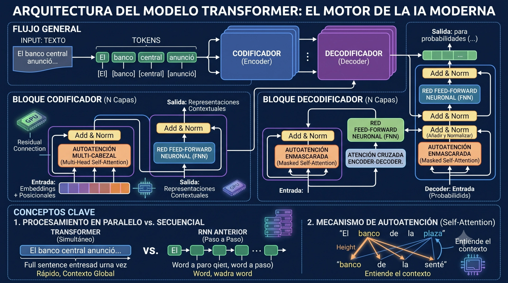

* ChatGPT
* Claude
* Gemini
* Copilot
* Llama
* Mistral
* DeepSeek
* Qwen

## LLM

Los **Modelos de Lenguaje de Gran Tamaño** (LLM, por sus siglas en inglés, *Large Language Models*) representan la base técnica de la inteligencia artificial generativa contemporánea. Se definen como sistemas computacionales diseñados para procesar, comprender y generar lenguaje natural con un nivel de fluidez y coherencia similar al humano.

Técnicamente, un LLM no posee conciencia, intenciones ni una comprensión real del mundo; funciona como un motor de predicción estadística altamente sofisticado. Su tarea principal consiste en la **predicción del siguiente token**: el modelo analiza una secuencia de texto de entrada (*prompt*) y calcula matemáticamente cuál es la unidad lingüística (palabra o fragmento de palabra) con mayor probabilidad de seguir a las anteriores basándose en los patrones aprendidos durante su entrenamiento.

El término "grande" hace referencia a dos dimensiones críticas de su escala:
*   **Parámetros:** Son las variables internas o "pesos" que el modelo ajusta durante su aprendizaje para representar patrones complejos. Los modelos actuales cuentan con miles de millones (billones en inglés) o incluso billones (trillones en inglés) de estos parámetros.

*   **Datos:** Se entrenan con conjuntos de datos masivos que abarcan trillones de palabras extraídas de libros, artículos, sitios web y depósitos de código, lo que les permite capturar la estructura gramatical y el conocimiento general de la cultura humana.

La mayoría de los LLM modernos se basan en la arquitectura de **Transformadores** (*Transformers*), introducida en 2017. Su innovación principal es el **mecanismo de auto-atención** (*self-attention*), que permite al modelo evaluar la importancia de cada palabra en una oración en relación con todas las demás, sin importar la distancia entre ellas. Esto otorga al sistema una capacidad inédita para manejar el contexto y las dependencias a largo plazo en un texto.

El desarrollo de un LLM generalmente sigue dos etapas:
1.  **Pre-entrenamiento:** Un proceso de aprendizaje autosupervisado donde el modelo "lee" volúmenes masivos de datos para aprender las reglas del lenguaje y hechos generales.

2.  **Ajuste Fino (*Fine-Tuning*):** El modelo base se entrena en tareas específicas o bajo directrices éticas, a menudo utilizando **Aprendizaje por Refuerzo a partir de Retroalimentación Humana (RLHF)**, para que sus respuestas sean más precisas, seguras y útiles para el usuario.

### Aplicación
En el contexto del Estado, los LLM se integran como herramientas para fortalecer el valor público mediante la automatización de la redacción de minutas e informes, la síntesis de grandes expedientes judiciales o administrativos, y la creación de asistentes virtuales que facilitan el acceso de la ciudadanía a trámites complejos. No obstante, su uso requiere una supervisión humana constante para mitigar riesgos como las **alucinaciones** (generación de información falsa pero plausible) o sesgos heredados de los datos de internet.

## Transformer

La arquitectura **Transformer** representa un hito fundamental en el campo de la Inteligencia Artificial y el Procesamiento del Lenguaje Natural (NLP), constituyendo la base técnica de modelos modernos como GPT, BERT y Claude. Introducida originalmente por investigadores de Google en el artículo de 2017 titulado *"Attention Is All You Need"*, esta arquitectura revolucionó la forma en que las máquinas procesan secuencias de datos.

<figure>

<figcaption></figcaption>
</figure>

El Transformer no es un robot de ciencia ficción sino que es arquitectura de red neuronal diseñada para manejar datos secuenciales (donde el orden de los elementos importa), pero que rompe con la tradición de las arquitecturas recurrentes (RNN) y de memoria a corto plazo (LSTM). A diferencia de sus predecesores, que procesaban el texto palabra por palabra de forma secuencial, el Transformer procesa la secuencia completa de manera simultánea.

Esta arquitectura es la tecnología fundacional que hace posibles los Grandes Modelos de Lenguaje (LLMs por sus siglas en inglés) que conocemos hoy, tales como ChatGPT (de OpenAI), Gemini (de Google) y Claude (de Anthropic).

Para entender por qué los Transformers revolucionaron la IA, es fundamental comprender cómo las máquinas leían el texto antes de su invención y cómo lo hacen ahora.

#### El problema de los modelos anteriores (Secuencialidad)
Antes de 2017, los modelos de IA leían el texto como lo hacemos los humanos al aprender a leer: palabra por palabra, en estricto orden secuencial de izquierda a derecha (utilizando modelos llamados Redes Neuronales Recurrentes o RNN).

Esto presentaba dos grandes problemas:

**Lentitud:** Al procesar una palabra a la vez, el entrenamiento de la IA era extremadamente lento.

**Pérdida de memoria a corto plazo:** Si un documento era muy largo, al llegar al final de la página, el modelo ya había "olvidado" el contexto del primer párrafo.

#### La solución del Transformer: Paralelismo y Contexto
La arquitectura Transformer rompió este límite estructural. En lugar de leer palabra por palabra, un Transformer procesa todas las palabras de una oración o texto de manera simultánea (en paralelo). Esto permitió reducir drásticamente los tiempos de entrenamiento y aprovechar el poder de las tarjetas gráficas modernas (GPUs) para procesar volúmenes masivos de datos.

La innovación central del Transformer es el mecanismo de **auto-atención**, que permite al modelo ponderar la importancia relativa de cada palabra en una oración respecto a todas las demás, sin importar la distancia física que las separe.

*   **Ponderación de Contexto:** Al procesar una palabra, el modelo "mira" el resto de la oración para entender el contexto. Por ejemplo, en la frase "El banco estaba cerrado", el mecanismo de atención ayuda a determinar si "banco" se refiere a una institución financiera o a un asiento basándose en las palabras circundantes.

*   **Captura de Dependencias:** Facilita la comprensión de relaciones gramaticales complejas y dependencias de largo alcance que antes se perdían en textos extensos.

*   **Atención de Múltiples Cabezales (Multi-head Attention):** Permite que el modelo analice simultáneamente diferentes tipos de relaciones entre las palabras (por ejemplo, una "cabeza" puede enfocarse en la sintaxis y otra en el significado semántico).

Un Transformer estándar se compone de dos bloques principales: el **Codificador (Encoder)** y el **Decodificador (Decoder)**.

*   **Codificador:** Transforma la secuencia de entrada en representaciones matemáticas (vectores) ricas en contexto.

*   **Decodificador:** Toma las representaciones del codificador y genera una secuencia de salida, un elemento a la vez, prediciendo el token más probable.

*   **Codificación Posicional (Positional Encoding):** Dado que los Transformers no procesan el texto secuencialmente, necesitan este componente para inyectar información sobre la posición u orden de las palabras en la secuencia.

*   **Capas de Avance (Feedforward Layers):** Después de la atención, cada bloque tiene redes neuronales densas que procesan las representaciones de forma independiente.

La transición hacia los Transformers se debió a dos beneficios críticos:
1.  **Paralelización:** Al no ser secuenciales, estos modelos pueden entrenarse mucho más rápido utilizando procesadores gráficos (GPU), lo que permitió el uso de conjuntos de datos masivos.

2.  **Escalabilidad:** Se descubrió que aumentar el número de parámetros (pesos) y de datos de entrenamiento en esta arquitectura resultaba en mejoras predecibles y significativas de desempeño, dando lugar a los Modelos de Lenguaje de Gran Tamaño (LLMs).

El éxito de esta arquitectura permitió el desarrollo de modelos especializados:
*   **BERT:** Basado solo en el codificador, optimizado para la comprensión profunda del lenguaje (análisis de sentimientos, búsqueda).
*   **GPT:** Basado principalmente en el decodificador, diseñado específicamente para la generación de texto coherente y fluido.
*   **Modelos Multimodales:** Actualmente, esta arquitectura se ha adaptado para procesar no solo texto, sino también imágenes, audio y video, permitiendo interacciones mucho más naturales.

## Modelos generativos

La **Inteligencia Artificial Generativa (IA Generativa)** es una rama avanzada del aprendizaje profundo (*Deep Learning*) que se enfoca en la creación de contenido original a partir de datos existentes. A diferencia de la IA tradicional o "predictiva", cuyo objetivo es clasificar datos o predecir resultados futuros basados en tendencias históricas, los modelos generativos utilizan algoritmos para identificar patrones subyacentes y generar nuevos datos que poseen características similares a los de su entrenamiento.

Técnicamente, estos sistemas no "entienden" el contenido en un sentido humano; son sistemas de predicción estadística altamente sofisticados. Funcionan descomponiendo la información en unidades mínimas llamadas **tokens** y calculando la probabilidad de que un elemento siga a otro en una secuencia coherente.

### Arquitecturas fundamentales

El auge actual de estos modelos se debe principalmente a tres tipos de arquitecturas de redes neuronales:

*   **Transformers:** Introducidos en 2017, permiten procesar datos en paralelo y entender relaciones de largo alcance en un texto mediante un mecanismo de "auto-atención". Es la base de los modelos de lenguaje actuales.

*   **Redes Generativas Adversarias (GANs):** Consisten en dos redes (un "generador" y un "discriminador") que compiten entre sí para crear imágenes o datos tan realistas que sean indistinguibles de los reales.

*   **Modelos de Difusión:** Técnica que genera imágenes a partir de ruido aleatorio, refinándolo progresivamente hasta que coincide con la descripción del usuario.

### Los modelos más utilizados en la actualidad

Dependiendo de la modalidad de salida, los modelos más destacados son:

#### Modelos de Lenguaje (Texto y Razonamiento)

En esencia, un modelo de lenguaje Grande **LLMs** (*Large Language Models*) es una máquina de completado estadístico masivo. A partir de la instrucción de usuario (**prompt**), el modelo realiza cálculos sobre sus **embeddings** para elegir probabilísticamente el siguiente token más lógico, construyendosu respuesta de manera incremental.

<figure>

<figcaption>Se establece la probabilidad más alta de elegir la siguiente palabra.</figcaption>
</figure>

Estos modelos, son los pilares de la gestión documental y la atención ciudadana en los ámbitos públicos donde haya sido adoptada.
*   **GPT (OpenAI):** Incluye las series GPT-3.5, GPT-4 y el reciente **GPT-4o**, que alimenta a ChatGPT. Es reconocido por su alta capacidad de razonamiento y seguimiento de instrucciones.

*   **Gemini (Google):** Un modelo multimodal nativo capaz de procesar texto, imágenes, audio y video de forma simultánea.

*   **Claude (Anthropic):** Destaca por su enfoque en la seguridad ética ("IA Constitucional") y su amplia ventana de contexto, permitiendo analizar documentos muy extensos.

*   **Llama (Meta):** El referente más importante en el ámbito del código abierto (*Open Source*), permitiendo que instituciones públicas desplieguen modelos en servidores propios para mayor soberanía tecnológica.

#### Generación de Imágenes (Visión Artificial)
*   **DALL-E 3 (OpenAI):** Integrado en ChatGPT, sobresale por su precisión al seguir instrucciones complejas y estructuradas.

*   **Midjourney:** Preferido en entornos creativos por su estética artística y fotorrealismo superior.

*   **Stable Diffusion:** Un modelo de código abierto altamente flexible que permite una personalización profunda y el uso de herramientas como ControlNet para dirigir la composición.

#### Video y Multimodalidad
*   **Sora (OpenAI):** Un modelo de vanguardia capaz de generar clips de video realistas de hasta un minuto a partir de texto.

*   **Runway Gen-2:** Pionero en la síntesis de video a partir de imágenes o descripciones textuales.

El uso de estos modelos (especialmente LLMs) se está orientando en todas las áreas del quehacer humano, sin distinción, y en el área de **gestión públca o de gobierno** a la redacción de informes jurídicos, la síntesis de consultas ciudadanas masivas y la automatización de trámites administrativos, siempre debiese ser eso si, bajo marcos de gobernanza como la [**ISO 42001**](/docs/iso42001).

¹Vaswani, A., et al. (2017). "Attention is all you need". Advances in neural information processing systems.