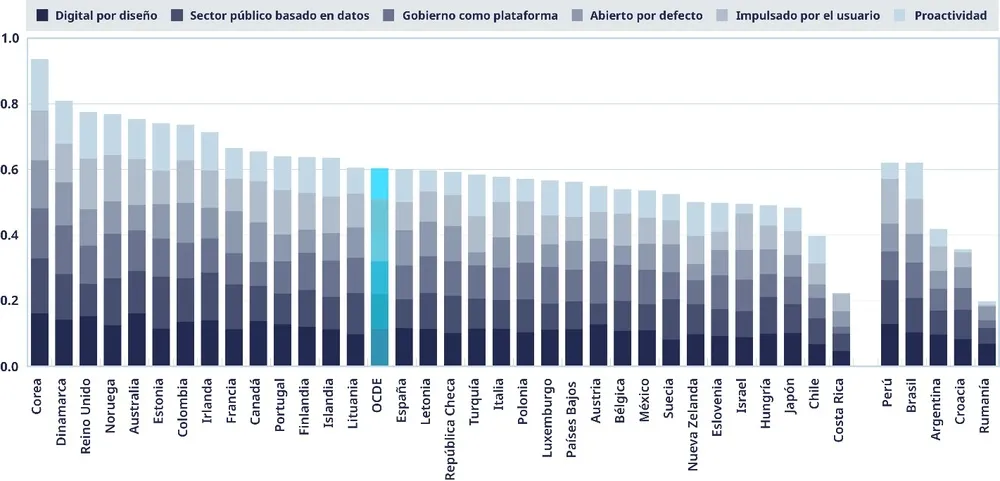
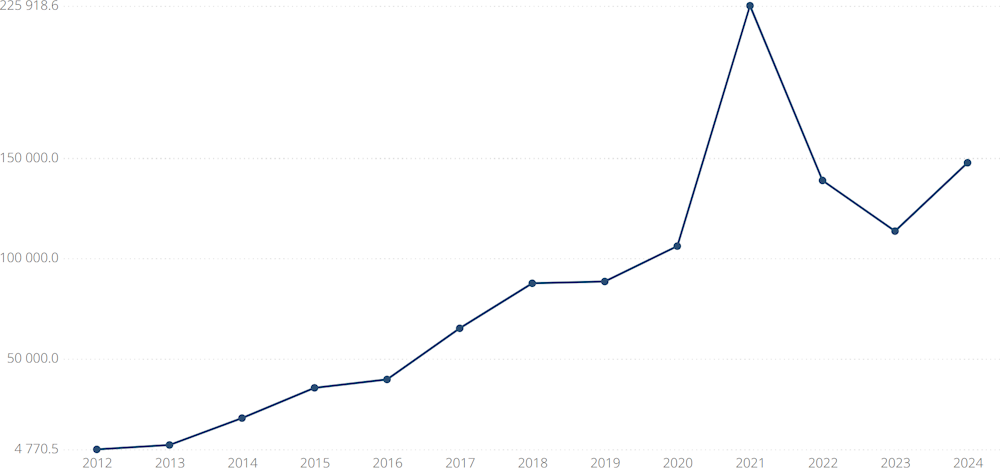
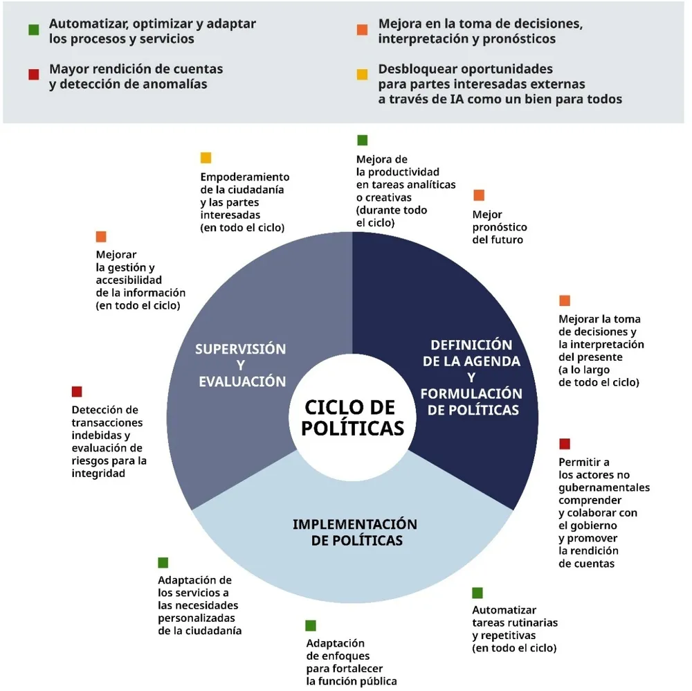

* Ley de Transformación Digital
* Gobierno Digital
* Servicios digitales
* Interoperabilidad

Índice de gobierno digital de la OCDE 2023, resultados compuestos por país.

<figure>

<figcaption>Nota: no se incluyen los datos de Alemania, Grecia, Eslovaquia, Suiza y Estados Unidos (EEUU) [^1].</figcaption>
</figure>

Inversión de capital global de riesgo en IA en millones de USD por país a partir de 2012

<figure>

<figcaption>El aumento de las inversiones en 2021 se debió en parte a un aumento de las inversiones en "atención sanitaria, medicamentos y biotecnología" con IA durante la pandemia de COVID-19. También se observó un repunte significativo ese año en el ámbito de la "Movilidad y vehículos autónomos"[^2].</figcaption>
</figure>

IA en cada fase del ciclo de formulación de políticas

<figure>

<figcaption>Adaptado a la terminología de la OCDE.</figcaption>
</figure>

[^1]: 2023 OECD Digital Government Index: Results and key findings”, OECD Public Governance Policy Papers, No. 44, OECD Publishing, Paris, https://doi.org/10.1787/1a89ed5e-en.
[^2]: OECD.AI (2025), visualizaciones impulsadas por JSI con datos de Preqin, última actualización del 3 de junio de 2025, consultado el 16 de junio de 2025, www.oecd.ai.