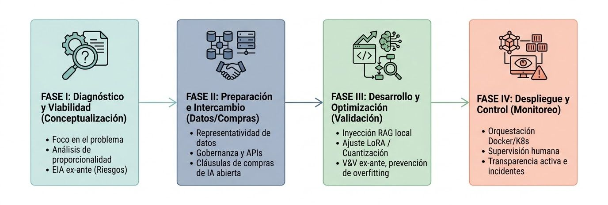

## Transición a Modelos de IA Open Source

En la era de la "IA como servicio", la autonomía tecnológica ha dejado de ser una preferencia técnica para convertirse en un imperativo de gobernanza democrática. Para el Estado, delegar la capacidad cognitiva en proveedores externos implica un riesgo inaceptable de subordinación estratégica. La transición hacia modelos Open Source permite a las instituciones públicas gestionar la distinción crítica entre la **Memoria Paramétrica** (el conocimiento estático grabado en los pesos del modelo durante su entrenamiento) y la **Memoria No Paramétrica** (el acervo dinámico de leyes, decretos y datos ciudadanos que reside en una base de conocimientos externa). Al controlar ambos dominios, el Estado garantiza que su infraestructura intelectual no dependa de actualizaciones de terceros ni sufra fugas de datos hacia nubes privadas.

### Análisis "Build vs. Buy": Modelos Propietarios frente a Arquitecturas Soberanas

| Factor de Decisión | APIs de Modelos Cerrados (Proprietarios) | Modelos Open Source (Auto-alojados) | Impacto Estratégico y Legal |
| :---- | :---- | :---- | :---- |
| **Privacidad de Datos** | Riesgo de exposición; los datos transitan por infraestructuras externas. | Control absoluto; los datos residen en centros de datos soberanos. | Cumplimiento estricto de leyes de **Residencia de Datos** y protección de PII. |
| **Personalización (Fine-tuning)** | Limitada por las políticas y herramientas del proveedor. | Total; permite adaptar el modelo a lenguajes técnicos gubernamentales. | Asegura que la IA refleje el contexto administrativo local sin sesgos externos. |
| **Costos Recurrentes** | OPEX variable basado en tokens (escalabilidad financieramente impredecible). | Inversión inicial (CAPEX) con costos de inferencia marginales controlados. | Transformación del presupuesto en activos de **Seguridad Nacional**. |
| **Control Algorítmico** | "Caja Negra"; lógica opaca que impide auditorías de procesos. | "Open Weights"; permite inspección matemática de los pesos del modelo. | Garantiza la **motivación de los actos administrativos** asistidos por IA. |

La eliminación de la dependencia de proveedores (*vendor lock-in*) no solo protege los derechos digitales de la ciudadanía, sino que asegura que el conocimiento generado por el Estado permanezca en el dominio público. Esta voluntad política de soberanía requiere, sin embargo, una infraestructura física capaz de sostenerla.

### Requerimientos de Hardware e Infraestructura Técnica

El cómputo es el nuevo activo estratégico del Estado. Una planificación deficiente crea cuellos de botella que asfixian la innovación; por el contrario, una arquitectura local bien dimensionada es una inversión en eficiencia operativa a largo plazo.

#### Arquitectura y la Lucha contra el Monopolio de Hardware

La soberanía tecnológica es imposible si el hardware está atado a un único stack propietario (ej. CUDA). Para mitigar monopolios, el Estado debe diversificar su capacidad de cómputo hacia ecosistemas abiertos como **AMD/ROCm** o aceleradores especializados como **Habana Gaudi**. El verdadero limitante de la velocidad de inferencia no es solo el procesamiento, sino el **HBM (High Bandwidth Memory)**; el ancho de banda de memoria determina cuántos tokens por segundo puede entregar el sistema a los funcionarios.
- https://www.nvidia.com/es-la/products/workstations/dgx-spark/
- https://www.amd.com/es/products/processors/desktops/ryzen/ryzen-ai-halo.html

#### "Memory Math" y Clasificación de Hardware

La capacidad de despliegue depende de la VRAM disponible. La adopción de técnicas de **Cuantización (INT4)** es vital para reducir los requerimientos de memoria sin sacrificar la utilidad del modelo:

* **Modelos 7B (7 mil millones de parámetros):** Requieren \~14GB VRAM (FP16), reducibles a **\~4-5GB (INT4)**. Ideales para tareas de clasificación en gobiernos locales.  
* **Modelos 13B:** Requieren \~26GB VRAM (FP16), reducibles a **\~8-10GB (INT4)**. Óptimos para procesamiento de documentos legales con matices semánticos.  
* **Modelos 70B:** Requieren \+140GB VRAM (FP16), reducibles a **\~40GB (INT4)**. Necesarios para razonamiento complejo y síntesis legislativa.

#### **Optimización y RAGOps**

Para escalar la inferencia local, se prescribe el uso de **vLLM** bajo orquestación de **Kubernetes/Docker**. Es crítico gestionar el balance entre **Latencia** (tiempo de respuesta por usuario) y **Throughput** (capacidad de procesar múltiples solicitudes), un compromiso fundamental en el stack de **RAGOps**.

Esta base física es el soporte necesario para el despliegue ético y metodológico del sistema.

<figure>

<figcaption>La hoja de ruta organiza la transición en el uso de IA.</figcaption>
</figure>

### Implementación Fase I: Diagnóstico y Viabilidad (Marco OCDE)

La IA en el sector público debe resolver problemas reales, no actuar como un escaparate tecnológico.

* **Auditorías de Fricción (Sludge Audits):** Identificación de procesos burocráticos donde la IA pueda eliminar "lodo" administrativo, devolviendo tiempo valioso tanto a funcionarios como a ciudadanos.  
* **Evaluación de Impacto Algorítmico (EIA):** Bajo la norma **ISO 42001**, se debe establecer un riesgo *ex-ante*. La transparencia de los pesos abiertos (*Open Weights*) es la única vía para demostrar matemáticamente la neutralidad del algoritmo ante una defensoría del pueblo o un tribunal administrativo.

La definición clara de liderazgos y objetivos es el factor determinante entre un experimento fallido y un servicio público escalable. Una vez definida la viabilidad, el éxito depende de la gobernanza de la materia prima: el dato.

### Implementación Fase II: Gobernanza de Datos y Alianzas

En el sector público, la representatividad de los datos es sinónimo de equidad.

* **Estrategia de Datos:** Protocolos de curación para neutralizar sesgos históricos. Un modelo entrenado con datos sesgados automatizará la discriminación en la asignación de recursos.  
* **Data Residency y Soberanía:** Es mandatorio que tanto los modelos como la **Base de Datos Vectorial** (donde reside el conocimiento sensible) permanezcan en suelo soberano.  
* **Cláusulas de Código Abierto:** Las compras públicas deben exigir que cualquier mejora o ajuste algorítmico financiado por el erario público sea devuelto al dominio público como un **Bien Común Digital**.

Con los datos gobernados, se procede a la construcción técnica del sistema basado en el conocimiento institucional.

### Implementación Fase III: Desarrollo, Optimización y RAG

Para mitigar el **Knowledge Cut-off** (fecha de corte de conocimiento) y las **Alucinaciones** inherentes a los modelos fundacionales, implementaremos sistemas de **Generación Aumentada por Recuperación (RAG)**. Este puente conecta la inteligencia del modelo con la veracidad de los documentos oficiales.

#### Pipeline de Indexación (Offline)

1. **Carga y Fragmentación (Chunking):** División de documentos oficiales en segmentos semánticos manejables.  
2. **Embeddings y Almacenamiento Vectorial:** Conversión de texto a vectores matemáticos almacenados en servidores locales seguros.

#### Pipeline de Generación (Tiempo Real)

1. **Recuperación (Retriever):** Ante una consulta, el sistema busca en la base no paramétrica los hechos actualizados.  
2. **Aumentación y Generación:** Se enriquece el *prompt* con el contexto recuperado, permitiendo que el LLM genere respuestas basadas exclusivamente en evidencia documental.

#### Validación mediante la "Tríada RAG"

Siguiendo la metodología técnica de Kimothi, la exactitud se medirá mediante el marco **RAGAS** enfocado en tres métricas críticas:

1. **Context Precision:** ¿Es relevante la información recuperada para la pregunta?  
2. **Faithfulness (Fidelidad):** ¿La respuesta proviene realmente del contexto recuperado o es una alucinación?  
3. **Answer Relevance:** ¿La respuesta aborda directamente la necesidad del ciudadano?

Esta arquitectura transforma a la IA de un juguete probabilístico a una herramienta de consulta normativa fiable.

### Implementación Fase IV: Despliegue, Monitoreo y Auditoría

El despliegue marca el inicio de un ciclo de responsabilidad pública continua.

* **Supervisión Humana (Human-in-the-loop):** Protocolos donde los funcionarios validan las decisiones asistidas por IA para asegurar el cumplimiento de la discrecionalidad administrativa.

* **Monitoreo de Desempeño y "Drift":** Detección de la degradación del modelo y obsolescencia de los datos mediante KPIs específicos como **MRR (Mean Reciprocal Rank)** y **nDCG (Normalized Discounted Cumulative Gain)**.

* **Transparencia Activa:** Publicación de registros algorítmicos. El diálogo social previene el rechazo tecnológico y garantiza que la IA sea un habilitador de derechos.

La meta final es una administración pública eficiente, soberana y transparente, donde el Estado posea y controle su propia inteligencia artificial para el beneficio de todos sus ciudadanos.

