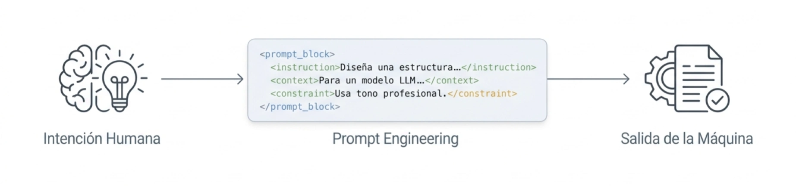

> El arte y la ciencia de comunicarse con la inteligencia artificial para obtener resultados precisos y útiles. Programar en lenguaje natural para guiar a los modelos de lenguaje hacia respuestas de alta calidad.

El **Prompt Engineering** (ingeniería de instrucciones) es la disciplina, en realidad una técnica más bien, encargada de diseñar, refinar y optimizar las entradas de texto (denominadas *prompts*) para guiar a los modelos de lenguaje (LLM) hacia la generación de respuestas precisas, útiles y de alta calidad. Se define comúnmente como el arte y la ciencia de comunicarse de manera efectiva con la inteligencia artificial para que esta realice tareas específicas según nuestras necesidades.

El Prompt Engineering no es un proceso de programación tradicional. No se trata de escribir código en un lenguaje de programación, sino de formular instrucciones en lenguaje natural que los modelos de IA puedan interpretar y ejecutar de manera óptima. Su objetivo es reducir la ambigüedad y mejorar la precisión de las respuestas generadas por la IA, minimizando así las "alucinaciones" (respuestas incorrectas o inventadas que parecen plausibles).

:::warning
Recuerda que el Prompt Engineering no reemplaza el conocimiento experto en la materia. La calidad de las respuestas generadas por la IA depende en gran medida de la claridad y precisión de las instrucciones proporcionadas.
:::

A continuación, se detallan los fundamentos de esta disciplina orientados especialmente con ejemplos en la gestión pública, si bien se aplican a todos los ámbitos donde se utilicen modelos de lenguaje.

## La esencia del Prompt Engineering
A diferencia de la programación tradicional, que utiliza códigos rígidos, el *prompt engineering* utiliza el lenguaje natural para interactuar con la IA. Su objetivo principal es reducir el "espacio de búsqueda" del modelo, minimizando las ambigüedades y la probabilidad de errores o "alucinaciones" (respuestas falsas pero convincentes).

Desde una perspectiva técnica, esta disciplina aprovecha el funcionamiento de los modelos de lenguaje: estos son sistemas de predicción que calculan la probabilidad de la siguiente palabra basándose en la información previa suministrada en el *prompt*. Al proporcionar una instrucción bien estructurada, estamos "programando" al modelo en tiempo real sin modificar su estructura interna.

## La anatomía de un prompt efectivo
Para que una instrucción sea exitosa, especialmente en el contexto del Estado, se recomienda seguir una estructura lógica. Un modelo ampliamente utilizado es el **CRTF** (o esquemas similares propuestos por Google), que desglosa el prompt en cuatro componentes esenciales:

*   **Rol (Persona):** Asigna una identidad o especialidad a la IA (ej. "Actúa como un analista de políticas públicas") para que el tono y la terminología sean los adecuados.

*   **Tarea:** Describe la acción específica que debe realizar (ej. "Redacta un resumen ejecutivo de este informe") utilizando verbos de acción claros.

*   **Contexto:** Proporciona los antecedentes y el escenario de trabajo (ej. "El informe trata sobre la brecha digital en zonas rurales bajo la nueva normativa X").

*   **Formato:** Especifica cómo debe entregarse la respuesta (ej. "Usa una lista de viñetas de máximo 200 palabras" o "Entrega el resultado en formato JSON").

## Importancia en la Gestión Pública

El *prompt engineering* transforma la interacción con la IA de un proceso de "prueba y error" a una herramienta de gestión estratégica. Permite a los profesionales automatizar tareas rutinarias —como la clasificación de solicitudes ciudadanas o el resumen de documentos legales— con un control preciso sobre la calidad del resultado, asegurando que la tecnología actúe como un colaborador eficiente.

Su importancia trasciende la mera interacción técnica, convirtiéndose en una herramienta estratégica para modernizar los servicios del Estado, optimizar procesos y asegurar que la tecnología actúe de manera ética y alineada con los valores institucionales.

**Antecedentes y fundamentos técnicos:**

### Transformación de la Eficiencia Operativa
El uso correcto de prompts permite automatizar tareas que tradicionalmente consumen cientos de horas hombre, permitiendo que los funcionarios se enfoquen en labores de mayor valor estratégico.

*   **India:** En el sector educativo superior, los docentes utilizan técnicas de *prompt engineering* para generar planes de estudio complejos a partir de esquemas básicos, asegurando que el contenido se alinee con los mandatos de los organismos reguladores (como el AICTE) en una fracción del tiempo que tomaría manualmente.

*   **Brasil:** El Tribunal Federal de Cuentas (TCU) implementó **ChatTCU**, un asistente que utiliza prompts específicos para que los auditores recuperen y sinteticen información de casos legales y normativas internas de forma inmediata.

### Mitigación de Riesgos y "Alucinaciones"

Uno de los mayores riesgos de la IA en el sector público es la generación de información falsa pero convincente (*hallucinations*). El *prompt engineering* sistemático, mediante técnicas como el **Chain of Thought (CoT)**, obliga al modelo a "pensar paso a paso", reduciendo drásticamente los errores de razonamiento lógico.

*   **Importancia Técnica:** Proporcionar un contexto suficiente y restrictivo actúa como un "conocimiento de dominio" temporal, evitando que el modelo recurra a datos internos poco confiables para la toma de decisiones críticas.

*   **Antecedente en el Reino Unido:** La incubadora de IA del gobierno (**i.AI**) desarrolló herramientas como **Lex** y **Parlex**, que utilizan prompts estructurados para interrogar la legislación británica y predecir reacciones parlamentarias con un alto grado de fidelidad técnica.

### Garantía de IA Responsable y Ética
En la gestión pública, cada instrucción debe cumplir con marcos de gobernanza y transparencia. Un prompt bien diseñado no es solo una pregunta, es un "programa en lenguaje natural" que dirige la ejecución del modelo bajo límites éticos.

*   **Caso en Chile:** La iniciativa de **Algoritmos Éticos** y las directrices de **ChileCompra** promueven el uso de plantillas de licitación estandarizadas que definen requisitos de transparencia y no discriminación, lo cual se traduce operativamente en instrucciones de prompts que prohíben el uso de datos protegidos o sesgados.

*   **Personalización del Servicio Ciudadano:** En Portugal, el Ministerio de Justicia utiliza prompts especializados en su chatbot **GPJ** para traducir la jerga legal compleja a un lenguaje sencillo y accesible para la ciudadanía, democratizando el acceso a la justicia.

### Estructura para el Funcionario Público

Para que un prompt sea efectivo en el Estado, se recomienda seguir la estructura **CRTF**, que asegura que la IA trabaje como un colaborador humano con instrucciones claras:
*   **Contexto (C):** Define el escenario (ej. "Estamos analizando la brecha digital rural").
*   **Rol (R):** Asigna una especialidad (ej. "Actúa como un asesor senior en políticas públicas").
*   **Tarea (T):** Describe la acción específica (ej. "Resume los tres principales riesgos de este informe").
*   **Formato (F):** Especifica la entrega (ej. "Entrega una tabla Markdown con columnas de Riesgo y Mitigación").

La importancia del *prompt engineering* en la gestión pública radica en su capacidad para convertir a la IA de una "caja negra" impredecible en un asistente administrativo riguroso, trazable y eficiente, capaz de generar valor público real bajo los estándares de seguridad y ética que el Estado exige.
