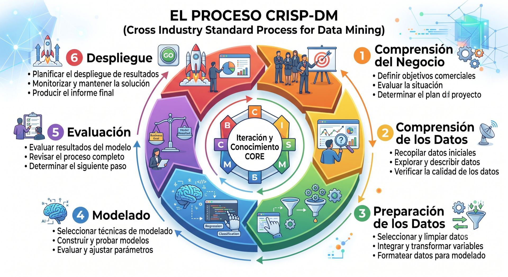
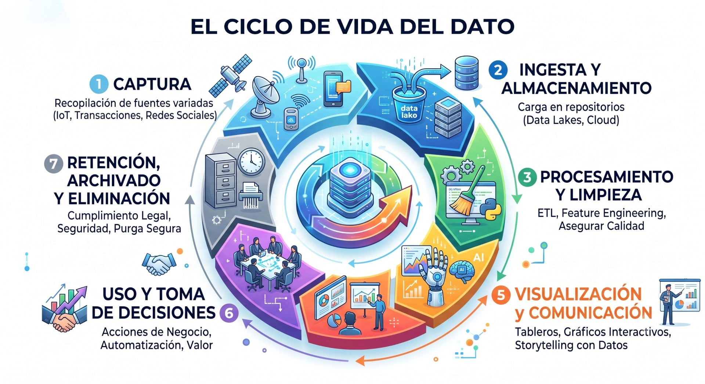
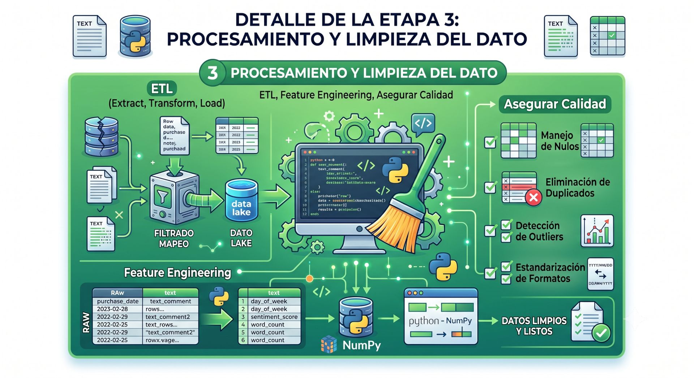
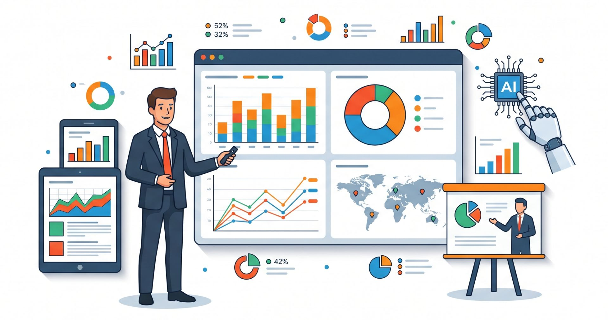
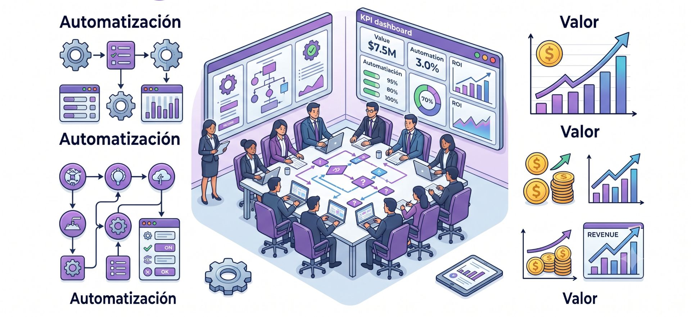

El concepto de **ciclo de vida del dato** se refiere al proceso paso a paso que atraviesa la información desde su origen o "nacimiento" hasta su transformación en conocimiento o sabiduría. En el contexto del Big Data y el Machine Learning, este ciclo no es un camino lineal, sino un **proceso iterativo y cíclico** donde los resultados de una etapa a menudo obligan a regresar y refinar pasos anteriores. 

El ciclo de vida de un proyecto de Ciencia de Datos (Data Science) describe las etapas clave desde la concepción del problema hasta la entrega de soluciones accionables basadas en datos.

### CRISP-DM

**CRISP-DM** (Cross-Industry Standard Process for Data Mining) es una metodología desarrollada a finales de los años 90 por un consorcio liderado por IBM, NCR y Daimler-Benz, con el objetivo de estandarizar los procesos de minería de datos en la industria. Su origen se remonta a la necesidad de crear un marco común y estructurado que facilitara la aplicación de técnicas de análisis de datos en distintos sectores, permitiendo replicabilidad y mejores prácticas.

<figure>

<figcaption></figcaption>
</figure>

El desarrollo de CRISP-DM fue financiado por la Comisión Europea y publicado oficialmente en 1999. Desde entonces, se ha convertido en el estándar de facto para proyectos de ciencia de datos y minería de datos, gracias a su enfoque flexible y adaptable.

La metodología CRISP-DM se compone de seis fases principales:

1. **Comprensión del negocio (Business Understanding):** Definir los objetivos del proyecto desde la perspectiva del negocio y traducirlos en una problemática de análisis de datos.
2. **Comprensión de los datos (Data Understanding):** Recolectar, describir y explorar los datos iniciales para identificar problemas de calidad y obtener insights preliminares.
3. **Preparación de los datos (Data Preparation):** Seleccionar, limpiar, transformar y construir los datos necesarios para el modelado.
4. **Modelado (Modeling):** Seleccionar y aplicar técnicas de modelado, calibrando los parámetros para obtener los mejores resultados.
5. **Evaluación (Evaluation):** Revisar los modelos generados para asegurar que cumplen los objetivos del negocio y decidir los próximos pasos.
6. **Despliegue (Deployment):** Implementar el modelo en el entorno productivo y asegurar su integración con los procesos de negocio.

CRISP-DM destaca por su carácter iterativo: las fases no son estrictamente secuenciales y es común regresar a etapas anteriores según los hallazgos y necesidades del proyecto. Su éxito radica en la claridad de sus etapas y en su aplicabilidad a proyectos de cualquier industria, promoviendo la comunicación efectiva entre equipos técnicos y de negocio.

## Ciclo de vida

<figure>

<figcaption>Proceso que atraviesa la información desde su origen hasta su transformación en conocimiento.</figcaption>
</figure>

Las etapas fundamentales son:

### Generación y Recolección (Ingestión)
El ciclo comienza con la adquisición de datos crudos desde diversas fuentes, que pueden ser ficheros (CSV, JSON, Excel), bases de datos, páginas web (vía web scraping) o sensores de IoT. En esta fase es crucial definir qué datos son necesarios para responder a una pregunta de negocio específica.

### Preparación y Preprocesamiento
Esta es a menudo la etapa que consume más tiempo. Incluye tareas esenciales para garantizar la **integridad de los datos**:
*   **Limpieza (Cleaning):** Eliminación de ruidos, errores de carga y datos inconsistentes.

*   **Tratamiento de valores nulos:** Decidir si se eliminan registros incompletos o se imputan valores (como la media o la moda).

*   **Normalización y Escalado:** Ajustar los datos para que tengan una escala uniforme, facilitando el trabajo de los algoritmos.

*   **Ingeniería de Características (Feature Engineering):** Creación de nuevas variables a partir de las originales para mejorar la capacidad predictiva.

<figure>

<figcaption>Esta serie de procesos son los que tradicionalmente capturan el mayor esfuerzo y recursos.</figcaption>
</figure>

### Almacenamiento y Gestión
Una vez procesados, los datos deben guardarse de forma segura y accesible. En entornos de Big Data, se suelen utilizar bases de datos **NoSQL** (como MongoDB) debido a su capacidad de escalabilidad horizontal y flexibilidad para manejar datos no estructurados.

### Análisis y Modelado (Machine Learning)
En esta fase se aplican algoritmos (supervisados o no supervisados) para extraer patrones, reconocer tendencias y construir modelos predictivos o de agrupación. Es el punto donde los datos se convierten propiamente en **información útil**.

### Evaluación y Visualización
Antes de su uso práctico, se mide la calidad del modelo mediante métricas (como la exactitud o el error cuadrático medio) utilizando conjuntos de datos de prueba que el modelo no ha visto antes. La **visualización de datos** juega aquí un papel clave para comunicar los hallazgos de forma efectiva a los interesados.

<figure>

<figcaption>Proceso que atraviesa la información desde su origen hasta su transformación en conocimiento.</figcaption>
</figure>

### Despliegue y Monitoreo
El modelo se pone en producción para generar predicciones en tiempo real. Sin embargo, el ciclo no termina aquí; es necesario un **monitoreo constante** para detectar el "data drift" (desviación de datos) o el deterioro del modelo, lo que eventualmente reinicia el ciclo para reentrenar el sistema con datos más recientes.

### Análisis de Negocio y Retroalimentación
Los resultados se evalúan frente a los objetivos estratégicos iniciales para generar **insights** que permitan tomar decisiones informadas o plantear nuevos proyectos.

<figure>

<figcaption></figcaption>
</figure>

